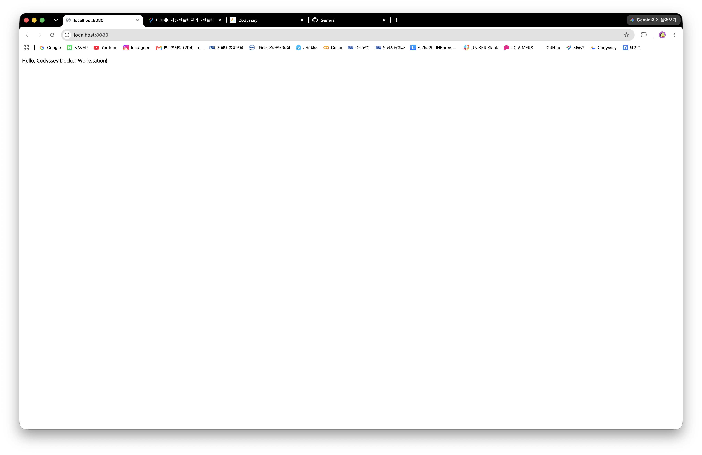
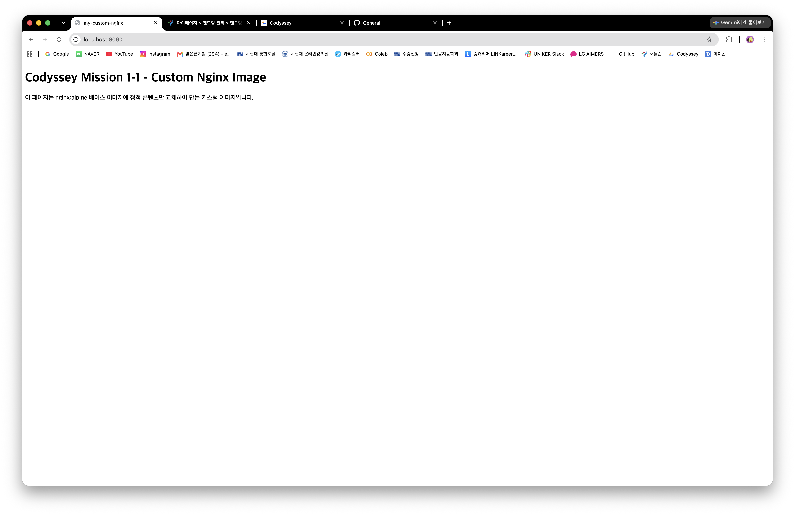
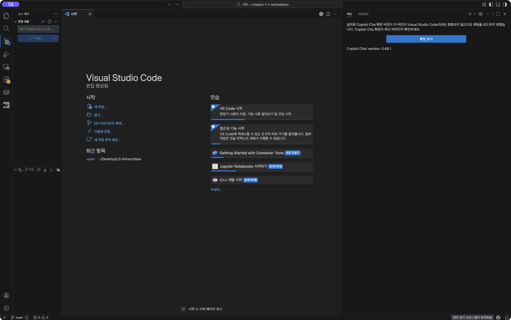

# 코디세이 미션 1-1: 내 컴퓨터에 개발자용 '작업실' 꾸미기

> 작성자: 하동현 (`ehdgus6697@gmail.com`)
>
> 수행일: 2026-08-19

## 0) 프로젝트 개요

- **목표**: 터미널, Docker(OrbStack), Git/GitHub를 직접 설정하고 동일한 개발 환경을 재현한다.
- **핵심 흐름**: 터미널·권한 실습 → Docker 점검 → 컨테이너 실행 → Dockerfile 빌드 → 포트 매핑 → 바인드 마운트 → Docker Volume → Git/GitHub 연동.
- **환경 특이사항**: 서울캠퍼스의 `sudo` 제약을 고려해 OrbStack의 Docker 엔진을 사용했다. 터미널 명령은 표준 `docker` CLI와 같다.

## 1) 실행 환경

| 항목 | 확인한 값 |
|---|---|
| OS | macOS 26.5.2 (Build 25F84) |
| CPU 아키텍처 | Apple Silicon / `aarch64` |
| Shell | `/bin/zsh`, zsh 5.9 |
| Terminal | macOS 기본 Terminal |
| Docker Client/Server | Docker 29.4.0 |
| Docker Context | `orbstack` |
| OrbStack | 2.2.2 |
| Docker Compose | v5.1.2 |
| Git | 2.55.0 |

확인 명령:

```bash
$ sw_vers
ProductName: macOS
ProductVersion: 26.5.2
BuildVersion: 25F84

$ echo $SHELL
/bin/zsh

$ zsh --version
zsh 5.9 (arm64-apple-darwin25.0)

$ docker --version
Docker version 29.4.0, build 9d7ad9f

$ docker info --format 'Server={{.ServerVersion}} OS={{.OperatingSystem}} Architecture={{.Architecture}}'
Server=29.4.0 OS=OrbStack Architecture=aarch64

$ git --version
git version 2.55.0
```

## 2) 폴더 구조

```text
mission-1-1-workstation/
├── README.md
├── .gitignore
├── app/
│   ├── app.py
│   ├── requirements.txt
│   └── Dockerfile
├── custom-image/
│   ├── Dockerfile
│   └── site/index.html
├── mount-demo/
│   └── index.html
├── bonus/
│   └── docker-compose.yml
├── docs/screenshots/
│   ├── port-8080.png
│   ├── port-8081.png
│   ├── custom-nginx-8090.png
│   └── vscode-github.png
├── practice/memo.txt
├── perm_test.sh
└── perm_dir/
```

## 3) 수행 항목 체크리스트

- [x] 터미널 기본 조작(경로, 목록, 생성, 복사, 이동, 삭제, 내용 확인)
- [x] 파일 1개와 디렉토리 1개 권한 변경 및 전후 비교
- [x] Docker(OrbStack) 설치·동작 점검
- [x] Docker 기본 운영 명령 실행
- [x] `hello-world` 실행
- [x] `ubuntu` 컨테이너 실행 및 내부 명령 수행
- [x] Dockerfile 기반 Flask 웹 서버 빌드·실행
- [x] 서로 다른 호스트 포트 8080·8081 접속
- [x] nginx 기반 커스텀 이미지 빌드·실행
- [x] 바인드 마운트의 호스트 변경 반영 검증
- [x] Docker Volume 영속성 검증
- [x] Git 사용자 정보와 기본 브랜치 설정
- [x] VS Code에서 GitHub 저장소 연동 확인
- [x] 실제 트러블슈팅 2건 기록
- [ ] (보너스) Docker Compose 멀티 컨테이너 실행

## 4) 터미널 기본 조작

작업 위치와 숨김 파일을 확인하고 파일 생성·복사·이동·내용 확인·삭제를 실행했다.

```bash
$ pwd
/Users/hadongtak/Desktop/codyssey/mission-1-1-workstation

$ ls -la
# README.md, .gitignore, app/, custom-image/ 등을 확인

$ cp practice/memo.txt practice/memo_copy.txt
$ mv practice/memo_copy.txt practice/memo_renamed.txt
$ cat practice/memo_renamed.txt
Codyssey mission 1-1 terminal practice
$ rm practice/memo_renamed.txt
```

- **절대경로**: `/Users/hadongtak/Desktop/codyssey/mission-1-1-workstation/practice/memo.txt`
- **상대경로**: 프로젝트 루트에서 `practice/memo.txt`
- 절대경로는 현재 위치와 관계없이 같은 파일을 가리키고, 상대경로는 현재 작업 디렉토리를 기준으로 해석된다.

## 5) 권한 실습

파일은 `644 → 755`, 디렉토리는 `755 → 700`으로 변경했다.

```bash
$ ls -l perm_test.sh
-rw-r--r-- ... perm_test.sh
$ chmod 755 perm_test.sh
$ ls -l perm_test.sh
-rwxr-xr-x ... perm_test.sh

$ ls -ld perm_dir
drwxr-xr-x ... perm_dir
$ chmod 700 perm_dir
$ ls -ld perm_dir
drwx------ ... perm_dir
```

권한 숫자는 소유자·그룹·기타 순서이며 `r=4`, `w=2`, `x=1`을 합산한다.

- `644 = rw-r--r--`: 소유자는 읽기·쓰기, 그룹과 기타는 읽기만 가능하다.
- `755 = rwxr-xr-x`: 소유자는 모든 권한, 그룹과 기타는 읽기·실행이 가능하다.
- `700 = rwx------`: 소유자만 모든 권한을 가진다.

## 6) Docker(OrbStack) 설치 및 점검

```bash
$ docker context show
orbstack

$ docker info --format 'Server={{.ServerVersion}} OS={{.OperatingSystem}} Architecture={{.Architecture}}'
Server=29.4.0 OS=OrbStack Architecture=aarch64
```

Client 명령뿐 아니라 Server 정보까지 출력되므로 Docker CLI와 OrbStack Docker 엔진의 연결을 확인했다.

## 7) Docker 기본 운영 명령

```bash
$ docker images
# codyssey-my-web:1.0, codyssey-custom-nginx:1.0, ubuntu:latest 등을 확인

$ docker ps -a
# 실행 중인 미션 컨테이너와 종료된 Ubuntu 컨테이너를 함께 확인

$ docker logs mission-web-8080
"GET / HTTP/1.1" 200
"GET /healthz HTTP/1.1" 200

$ docker stats --no-stream mission-web-8080 mission-web-8081
# 각 컨테이너의 CPU, 메모리, 네트워크 사용량을 한 번 출력
```

`docker ps`는 실행 중인 컨테이너만, `docker ps -a`는 종료된 컨테이너까지 모두 보여 준다.

## 8) 기본 컨테이너 실행

```bash
$ docker run --rm hello-world
Hello from Docker!
This message shows that your installation appears to be working correctly.

$ docker run --rm ubuntu bash -lc 'pwd; echo hello-from-ubuntu-container; id'
/
hello-from-ubuntu-container
uid=0(root) gid=0(root) groups=0(root)
```

### `start -ai`와 `exec` 비교

- `docker start -ai my-ubuntu`는 종료된 **기존 컨테이너**를 시작하고 원래의 주 프로세스(`bash`)에 연결한다. 기존 컨테이너의 `/tmp/my-file.txt`가 남아 있는 것을 확인했다.
- `docker exec mission-vol-2 cat /data/hello.txt`는 이미 실행 중인 컨테이너에서 **별도 프로세스**를 실행한다. 명령이 끝나도 주 프로세스인 `sleep infinity`와 컨테이너는 계속 실행됐다.

## 9) Dockerfile 기반 Flask 웹 서버

소스는 [`app/app.py`](app/app.py), 이미지 정의는 [`app/Dockerfile`](app/Dockerfile)에 있다. 컨테이너 내부 5000번 포트를 두 개의 호스트 포트로 연결했다.

```bash
$ cd app
$ docker build -t codyssey-my-web:1.0 .
# 빌드 성공: image codyssey-my-web:1.0

$ docker run -d -p 8080:5000 --name mission-web-8080 codyssey-my-web:1.0
$ docker run -d -p 8081:5000 --name mission-web-8081 codyssey-my-web:1.0

$ curl http://localhost:8080
Hello, Codyssey Docker Workstation!

$ curl http://localhost:8081
Hello, Codyssey Docker Workstation!

$ curl http://localhost:8080/healthz
{"status":"ok"}
```

접속 증거:

- 8080: 
- 8081: 

포트 매핑 `8080:5000`은 `호스트 포트:컨테이너 포트`다. 컨테이너는 격리된 네트워크를 사용하므로 `-p`로 연결하지 않으면 Mac 브라우저에서 컨테이너의 5000번 포트에 직접 접근할 수 없다.

## 10) nginx 기반 커스텀 이미지

- 베이스 이미지: `nginx:alpine`
- `ENV APP_ENV=dev`: 실행 환경 구분값 설정
- `COPY site/ /usr/share/nginx/html/`: 기본 페이지를 직접 만든 페이지로 교체
- `RUN chmod -R a+rX ...`: nginx 작업 프로세스가 정적 파일을 읽을 수 있도록 권한 보장

```bash
$ cd custom-image
$ docker build -t codyssey-custom-nginx:1.0 .
$ docker run -d -p 8090:80 --name mission-custom-nginx codyssey-custom-nginx:1.0
$ curl http://localhost:8090
<!DOCTYPE html>
...
<h1>Codyssey Mission 1-1 - Custom Nginx Image</h1>
```

접속 증거: 

## 11) 바인드 마운트 변경 반영

호스트의 [`mount-demo/index.html`](mount-demo/index.html)을 nginx 컨테이너의 문서 루트에 읽기 전용으로 연결했다.

```bash
$ docker run -d -p 8082:80 \
    -v /Users/hadongtak/Desktop/codyssey/mission-1-1-workstation/mount-demo:/usr/share/nginx/html:ro \
    --name mission-bind-mount nginx:alpine
```

변경 전:

```html
<h1>Bind mount: before</h1>
```

호스트 파일 수정 후 컨테이너 재빌드나 재시작 없이 다시 요청한 결과:

```html
<h1>Bind mount: after host file change</h1>
```

바인드 마운트는 Docker 이미지에 파일을 복사하는 것이 아니라 호스트 경로를 컨테이너 경로에 직접 연결하므로 변경이 즉시 보였다.

## 12) Docker Volume 영속성

```bash
$ docker volume create codyssey-mission-data
codyssey-mission-data

$ docker run -d --name mission-vol-1 \
    -v codyssey-mission-data:/data ubuntu sleep infinity
$ docker exec mission-vol-1 bash -lc \
    'echo codyssey-volume-persisted > /data/hello.txt && cat /data/hello.txt'
codyssey-volume-persisted

$ docker rm -f mission-vol-1
mission-vol-1

$ docker volume ls --filter name=codyssey-mission-data
local  codyssey-mission-data

$ docker run -d --name mission-vol-2 \
    -v codyssey-mission-data:/data ubuntu sleep infinity
$ docker exec mission-vol-2 cat /data/hello.txt
codyssey-volume-persisted
```

첫 컨테이너를 삭제한 뒤 새 컨테이너에 같은 Volume을 연결해도 파일이 남아 있었다.

- **바인드 마운트**: 사용자가 지정한 호스트 경로를 직접 연결한다. 파일 위치가 눈에 보이지만 호스트 경로에 의존한다.
- **Docker Volume**: Docker가 관리하는 저장소다. 컨테이너 생명주기와 분리되어 재사용과 이식이 쉽다.

## 13) Git 및 GitHub 연동

```bash
$ git config --global --get user.name
hadonghyun
$ git config --global --get user.email
ehdgus6697@gmail.com
$ git config --global --get init.defaultBranch
main
```

기존 이메일 끝에 잘못 붙어 있던 `n`을 제거해 올바른 주소로 수정했다. 민감한 토큰은 문서와 스크린샷에 포함하지 않았다.

- **Git**: 내 컴퓨터에서 파일 변경 이력, 브랜치, 커밋을 관리하는 버전 관리 시스템이다.
- **GitHub**: Git 저장소를 원격으로 보관하고 다른 사람과 Pull Request, Issue 등으로 협업하는 서비스다.
- **원격 저장소**: [ehdgus6697-debug/mission-1-1-workstation](https://github.com/ehdgus6697-debug/mission-1-1-workstation) (비공개로 생성)
- VS Code Source Control에서 `main`, `origin/main`, 변경 내용 없음과 동기화 상태를 확인했다.
- 연동 증거: 

## 14) 트러블슈팅

### 사례 1: Docker API 소켓 연결 실패

- **문제**: `docker run`에서 `~/.orbstack/run/docker.sock: no such file or directory`가 출력됐다.
- **원인 가설**: Docker CLI는 `orbstack` context를 보고 있지만 OrbStack Docker 엔진이 중지된 상태였다.
- **확인**: 오류 경로가 OrbStack 소켓이고, OrbStack 실행 후 `docker info`가 Server 29.4.0과 OS OrbStack을 출력했다.
- **해결**: OrbStack을 먼저 실행하고 `docker info`로 Client와 Server 연결을 확인한 후 명령을 다시 실행했다.

### 사례 2: 커스텀 nginx 페이지에서 403 Forbidden

- **문제**: `http://localhost:8090` 요청이 403을 반환했다.
- **원인**: 호스트의 `site/index.html` 권한이 `600`이었고 Docker `COPY` 후에도 `-rw------- root root`로 유지되어 nginx 작업 프로세스가 읽지 못했다.
- **확인**: `docker logs mission-custom-nginx`에서 `open() ... failed (13: Permission denied)`를 확인했다.
- **해결**: Dockerfile에 `RUN chmod -R a+rX /usr/share/nginx/html`을 추가하고 다시 빌드했다. 이후 `curl http://localhost:8090`에서 커스텀 HTML이 반환됐다.

## 15) 보너스: Docker Compose

[`bonus/docker-compose.yml`](bonus/docker-compose.yml)은 Flask 웹 서비스와 Redis를 하나의 프로젝트로 실행하는 예시다. 필수 항목 완료와 분리하기 위해 보너스 실행 결과는 아직 체크하지 않았다.

```bash
$ cd bonus
$ docker compose up -d
$ docker compose ps
$ docker compose exec web getent hosts redis
$ docker compose down
```

## 16) 평가자 재현 방법

```bash
# Flask 이미지와 두 포트
cd app
docker build -t codyssey-my-web:1.0 .
docker run -d -p 8080:5000 --name mission-web-8080 codyssey-my-web:1.0
curl http://localhost:8080/healthz

# 커스텀 nginx 이미지
cd ../custom-image
docker build -t codyssey-custom-nginx:1.0 .
docker run -d -p 8090:80 --name mission-custom-nginx codyssey-custom-nginx:1.0
curl http://localhost:8090
```

컨테이너 이름이나 포트를 이미 사용 중이면 기존 테스트 컨테이너를 정리하거나 다른 호스트 포트를 사용한다. 비밀번호, API 키, GitHub 토큰은 저장소에 포함하지 않는다.
